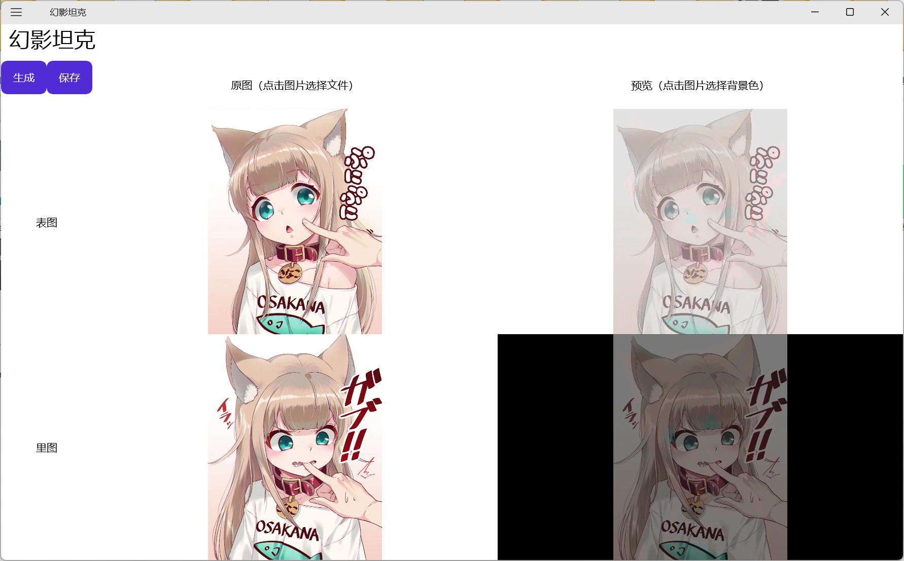

彩色幻影坦克制作工具MAUI，还支持调整背景色，适应贴吧发帖气泡。支持Windows和Android平台。

作者：埃博拉酱

<u>[欢迎提交 GitHub Issue 或PR](https://github.com/Ebola-Chan-bot/MirageTank)</u>

# 使用说明
点击原图列中的两张图，可以从文件中选择表图和里图。点击预览中的两张图，可以选择表图和里图的背景色。默认来说，表图是白色背景，里图是黑色背景，则无需手动选择，直接点击“生成”。等待一段时间后即可生成幻影坦克，然后点击“保存”选择要输出到的位置。在Windows上，还支持图片的右键复制粘贴。
# 常见问题
如果生成步骤等待时间太长，检查你选择的图片尺寸，像素越多计算时间就越久。多数社交平台上没有必要发送过于高清的图，可以在制作幻影坦克前适当缩减像素。